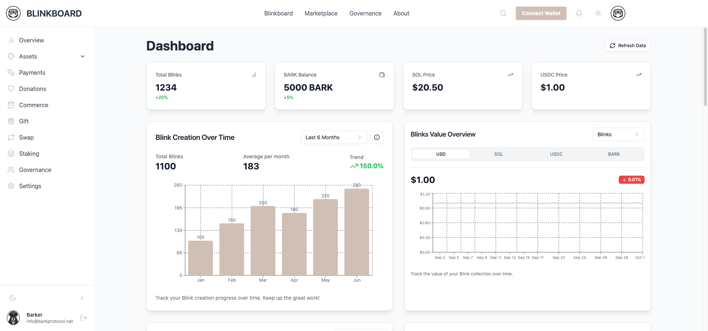

# BARK Blink Dashboard



## Overview

The BARK Protocol Dashboard "Blinkboard" is a web application built with Next.js and TypeScript, designed to interact with the Solana blockchain. It allows users to create, send, and sell Solana Blinks, track BARK tokens, and participate in governance. The dashboard supports dark and light themes, is responsive, and is ready for internationalization.

## Features

- **Create, Send, and Sell Solana Blinks**: Effortlessly create, send, and list your Blinks for sale on the marketplace.
- **Interactive Dashboard**: Easily manage and analyze your Blinks.
- **BARK Token Management**: Track your BARK token balance and transaction history.
- **Governance Participation**: Engage in voting and governance proposals.
- **Theme Support**: Switch between dark and light modes.
- **Internationalization**: Ready for multiple languages and locales.
- **Responsive Design**: Seamlessly access the dashboard on desktop and mobile devices.
- **Airdrop Management**: Create and manage airdrop campaigns for NFTs and SPL tokens.
- **NFT Minting**: Mint exclusive BARK NFTs using Solana's blockchain effortlessly.
- **Leaderboard**: Engage with the community by tracking top contributors and mascots.
- **Wallet Integration**: Connect with popular Solana wallets like Phantom, Solflare, and Backpack.
- **Community Engagement**: Support and reward community members with a royalty system on NFT resales.

## Installation

To get started with the BARK Protocol Dashboard, follow these steps:

### Prerequisites

- Node.js (v14 or later)
- Yarn or npm

### Clone the Repository

```bash
git clone https://github.com/barkprotocol/blinkboard.git
```

### Install Dependencies

```bash
pnpm install
# or
yarn install
```

### Set Up Environment Variables

Create a `.env.local` file in the root directory and add your environment variables:

```
NEXT_PUBLIC_SUPABASE_URL=your_supabase_url
NEXT_PUBLIC_SUPABASE_ANON_KEY=your_supabase_anon_key
NEXT_PUBLIC_SOLANA_NETWORK=devnet
NEXT_PUBLIC_SOLANA_RPC_URL=https://api.devnet.solana.com
NEXT_PUBLIC_MINT_API_URL=
TOKEN_PROGRAM_ID=TokenkegQfeZyiNwAJbNbGKPFXkQd5J8X8wnF8MPzYx
NFT_PROGRAM_ID=gEb7nD9yLkau1P4uyMdke9byJNrat61suH4vYiPUuiR
DEFAULT_WALLET_ADDRESS=gEb7nD9yLkau1P4uyMdke9byJNrat61suH4vYiPUuiR
METADATA_SERVICE_URL=https://api.example.com/upload-metadata
ERROR_TRACKING_SERVICE_URL=https://errors.example.com/report
SECRET_KEY=your-secret-key-here
JWT_SECRET=your-jwt-secret-key-here
NODE_ENV=development
```

### Start the Development Server

```bash
npm run dev
# or
yarn dev
```

Open [http://localhost:3000](http://localhost:3000) in your browser to view the application.`

## Contributing

We welcome contributions! Please read our [CONTRIBUTING.md](CONTRIBUTING.md) for more information on how to contribute to the project.

## License

This project is licensed under the Apache 2.0 License. See the [LICENSE](LICENSE) file for details.